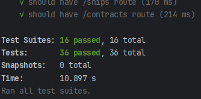

# Codeminer API

## Description
This is the Codeminer API, designed to manage a fleet of cargo transport across the galaxy. The API allows for the creation and management of contracts, pilots, ships, resources, and travels.

## Installation
1. Clone the repository:
    ```bash
    git clone <REPOSITORY_URL>
    cd api_codeminer
    ```

2. Install the dependencies:
    ```bash
    npm install
    ```

3. Configure the environment variables in the `.env` file (use the `.env.example` file as a template).

## Usage
### Starting the Server
To start the server, run:
```bash
npm start
```

### Running Tests
To run the tests, use:
```bash
npm test
```

## Endpoints
### Pilots
* **Add Pilot**
  * POST /pilots
  * Body:
  ```json
  {
      "certification": "string",
      "name": "string",
      "age": number,
      "credits": number,
      "location": "string",
      "ship": "ObjectId"
  }
  ```

* **List Pilots**
  * GET /pilots

### Ships
* **Add Ship**
  * POST /ships
  * Body:
  ```json
  {
      "name": "string",
      "type": "string",
      "registrationNumber": "string",
      "capacity": number,
      "fuelLevel": number,
      "weightCapacity": number
  }
  ```

* **List Ships**
  * GET /ships

### Contracts
* **Add Contract**
  * POST /contracts
  * Body:
  ```json
  {
    "description": "string",
    "payload": [{ "name": "string", "weight": number }],
    "origin": "string",
    "destination": "string",
    "value": number,
    "pilot": "ObjectId"
  }
  ```

* **List Contracts**
  * GET /contracts

* **Accept Contract**
  * POST /contracts/:id/accept

### Resources
* **Add Resource to Pilot**
  * POST /resources
  * Body:
  ```json
  {
      "pilotId": "ObjectId",
      "contractId": "ObjectId",
      "name": "string",
      "weight": number,
      "amount": number
  }
  ```

* **Generate Pilot Report**
  * GET /resources/report/:pilotId

### Travels
* **Add Travel**
  * POST /travels
  * Body:
  ```json
  {
      "pilotId": "ObjectId",
      "shipId": "ObjectId",
      "origin": "string",
      "destination": "string",
      "fuelConsumed": number
  }
  ```

* **List Travels**
  * GET /travels

## Project Structure
```lua
api_codeminer/
├── .env
├── jest.config.js
├── jest.setup.js
├── package.json
├── package-lock.json
├── src/
│   ├── app.js
│   ├── database.js
│   ├── controllers/
│   │   ├── contractsController.js
│   │   ├── pilotsController.js
│   │   ├── resourcesController.js
│   │   ├── shipsController.js
│   │   └── travelsController.js
│   ├── models/
│   │   ├── contract.js
│   │   ├── pilot.js
│   │   ├── resource.js
│   │   ├── ship.js
│   │   └── travel.js
│   ├── routes/
│   │   ├── contracts.js
│   │   ├── index.js
│   │   ├── pilots.js
│   │   ├── resources.js
│   │   ├── ships.js
│   │   └── travels.js
├── tests/
│   ├── controllers/
│   │   ├── contractsController.test.js
│   │   ├── pilotsController.test.js
│   │   ├── resourcesController.test.js
│   │   ├── shipsController.test.js
│   │   └── travelsController.test.js
│   ├── models/
│   │   ├── contract.test.js
│   │   ├── pilot.test.js
│   │   ├── resource.test.js
│   │   ├── ship.test.js
│   │   └── travel.test.js
│   ├── routes/
│   │   ├── contracts.test.js
│   │   ├── index.test.js
│   │   ├── pilots.test.js
│   │   ├── resources.test.js
│   │   ├── ships.test.js
│   │   └── travels.test.js
```

## Technologies Used
- **Node.js**
- **Express**
- **Mongoose**
- **Jest**
- **Nodemon**
- **Supertest**