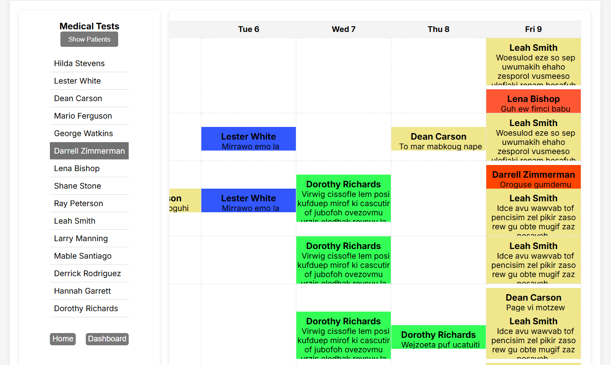
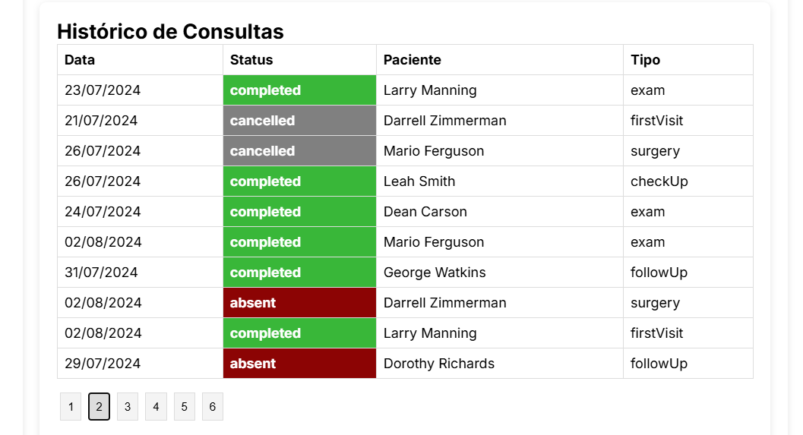
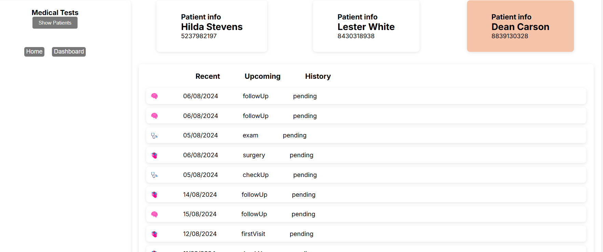
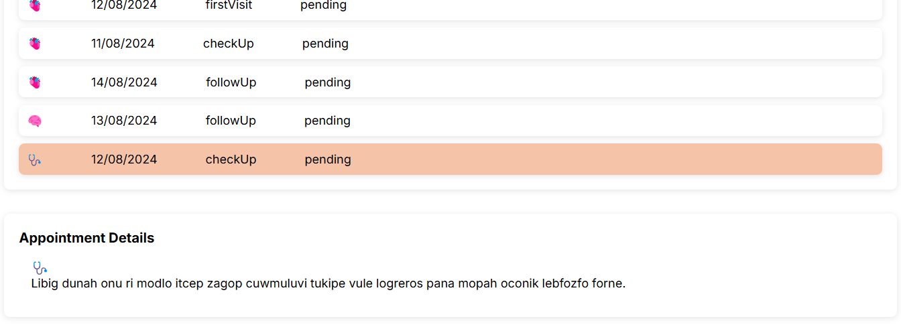
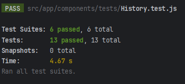

# Frontend Project - Calendar and Dashboard

## Description
This project is a frontend application composed of two main pages: Calendar and Dashboard. The application is designed to manage and view medical appointments and related tests.

## Pages

### Calendar Page
- **Colorful Events**: Events are displayed in colored sections, with each patient assigned a specific color.
- **Appointment History**: Recent appointments are shown in a paginated history and marked by color for easy identification.


### Dashboard
- **Default State**: The page remains in a default state if there is no user interaction.
- **Preferred Patients**: The top 3 patients from appointments are given preference.
- **Appointment Listing**: Appointments are organized into three categories:
    - **Recent**: Recent appointments.
    - **Upcoming**: Future appointments.
    - **History**: Past appointments.
    - Clicking on an item shows its description in the Appointment Details section.

- **Menu Interaction**: Clicking the Recent, Upcoming, and History menus a second time closes the menu.

### Medical Tests Section
- **Patient List**: The Medical Tests section lists patients received via request and is prepared for a potential individual page for each patient.

## Libraries Used

### Dependencies
- **axios**: ^1.7.3 - Promise-based HTTP client for making requests.
- **react-dom**: ^18 - Library for rendering React components to the DOM.
- **react-router-dom**: ^6.26.0 - Library for routing in React applications.

### Development Dependencies
- **@babel/preset-env**: ^7.25.3 - Babel preset for compiling modern JavaScript.
- **@babel/preset-react**: ^7.24.7 - Babel preset for compiling React code.
- **@jest/globals**: ^29.7.0 - Provides Jest globals.
- **@testing-library/jest-dom**: ^6.4.8 - Jest DOM matchers extensions.
- **@testing-library/react**: ^16.0.0 - Tools for testing React components.
- **axios-mock-adapter**: ^1.22.0 - Adapter for mocking Axios responses in tests.
- **babel-jest**: ^29.7.0 - Babel transformer for Jest.
- **jest**: ^29.7.0 - Testing framework for JavaScript.
- **jest-environment-jsdom**: ^29.7.0 - jsdom-based test environment for Jest.
- **jest-module-name-mapper**: ^0.1.5 - Maps module paths for Jest.
- **jest-transform-css**: ^6.0.1 - CSS transformer for Jest.
- **next**: ^14.2.5 - React framework for front-end application development.
- **next-router-mock**: ^0.9.13 - Mock for Next.js router in tests.
- **react**: ^18.3.1 - Library for building user interfaces.
- **react-test-renderer**: ^18.3.1 - Renderer for generating a test representation of React components.

## Installation

1. Clone the repository:
    ```bash
    git clone <REPOSITORY_URL>
    ```

2. Navigate to the project directory:
    ```bash
    cd project-name
    ```

3. Install dependencies:
    ```bash
    npm install
    ```

4. Start the development server:
    ```bash
    npm start
    ```

## Tests
There may be a console.error warning about an outside use of a function. The application is fine and passes the tests, it's just the warning about an iteration outside the flow.
To run tests, use the command:
```bash
npm test
```


## Contributions

If you wish to contribute to this project, please fork the repository and create a branch for your changes. Submit a pull request when you are ready.

## License

This project is licensed under the MIT License - see the LICENSE file for details.

---